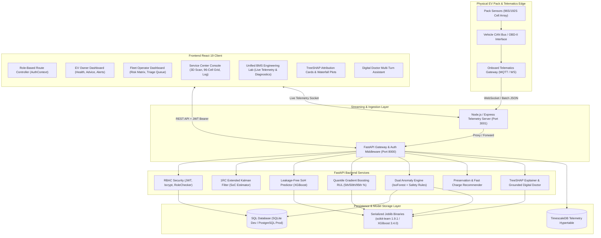

# System Architecture & Technical Specifications

**AI-Driven Battery Intelligence Platform (EVBMS)**  
*Next-Generation Electric Vehicle Battery Management, Predictive Analytics & Explainable AI*

---

## 1. High-Level System Architecture

The EV Battery Intelligence Platform comprises a decoupled, reactive modern architecture designed for real-time edge/cloud telemetry ingestion, state estimation, machine learning inference, and explainable AI diagnostics.

---

## 2. End-to-End Telemetry & Diagnostics Data Flow

```mermaid
sequenceDiagram
    autonumber
    actor Driver as EV Owner / Fleet Asset
    participant BMS as Battery Telemetry Stream
    participant API as FastAPI Ingestion & State Engine
    participant ML as ML Inference & XAI Pipeline
    participant DB as Persistence (TimescaleDB / SQLite)
    participant UI as Role-Based Dashboard
    participant LLM as Digital Doctor (Gemini / Offline Template)

    BMS->>API: POST /api/telemetry/batch or WS frame (V, I, T, cell_voltages)
    
    rect rgb(20, 30, 45)
        note over API, ML: State Estimation & Feature Computation
        API->>ML: 1RC Extended Kalman Filter step(I, V_terminal)
        ML-->>API: Filtered SoC (%), Innovation Residual, Covariance
        API->>ML: Extract features (cycle, V_norm, T, IR, delta_V, temp_rate)
    end

    rect rgb(30, 25, 45)
        note over API, ML: Predictive Degradation & Anomaly Scans
        API->>ML: Predict SoH (XGBoost non-leaky)
        API->>ML: Predict Quantile RUL (5th, 50th, 95th percentiles)
        API->>ML: Run Anomaly Detector (IsoForest + Physics Rules)
        ML-->>API: Continuous Risk Score (0-100), Categorical Risk, Lead-Time (s)
    end

    opt Failure Warning Triggered (Watch or Critical Risk)
        API->>DB: Persist alert to AlertLogModel
        API-->>UI: Real-time alert push to AlertFeed
    end

    API->>ML: Compute TreeSHAP attributions for active prediction
    ML-->>API: Attributions (e.g., cycle: -0.052, voltage: +0.078)
    API->>API: Generate optimal charging recommendation (mode, buffer, rate)
    API-->>UI: Render updated vitals, quantile interval band, and recommendations

    opt User Requests Diagnostic Explanation
        Driver->>UI: Clicks "Consult Digital Doctor"
        UI->>API: POST /predict/chat-digital-doctor (prompt, thread, telemetry context)
        API->>LLM: Formulate system prompt grounded strictly in TreeSHAP & telemetry
        LLM-->>API: Streamed diagnostic explanation
        API->>API: Verify numerical citations against telemetry (reject hallucinations)
        API-->>UI: Verified response in DigitalDoctorDrawer
    end
```

---

## 3. Trustworthy Machine Learning Pipeline

### 3.1. Leave-One-Battery-Out (LOBO) Cross-Validation
Standard random train/test splits inadvertently leak cell-specific manufacturing traits across rows of the same physical pack. The EVBMS training pipeline employs strict **Leave-One-Battery-Out (LOBO)** cross-validation (`backend/training/evaluate.py`), holding out entire distinct battery cells (e.g. NASA B0005, B0006, B0007, B0018) for zero-leakage evaluation.

```mermaid
flowchart LR
    subgraph DataPool ["NASA Ames Battery Aging Dataset"]
        Cell5["Battery B0005 (168 Cycles)"]
        Cell6["Battery B0006 (168 Cycles)"]
        Cell7["Battery B0007 (168 Cycles)"]
        Cell18["Battery B0018 (132 Cycles)"]
    end

    subgraph Folds ["LOBO Cross-Validation Folds"]
        F1["Fold 1: Train {B6, B7, B18} -> Test {B5}"]
        F2["Fold 2: Train {B5, B7, B18} -> Test {B6}"]
        F3["Fold 3: Train {B5, B6, B18} -> Test {B7}"]
        F4["Fold 4: Train {B5, B6, B7} -> Test {B18}"]
    end

    subgraph Baselines ["Comparative Benchmark Baselines"]
        B_Mean["Predict-the-Mean Baseline"]
        B_Linear["Linear-in-Cycle Baseline (SoH)"]
        B_Coulomb["Coulomb Counting Baseline (SoC)"]
        B_Extrap["Linear Extrapolation Baseline (RUL)"]
    end

    subgraph FinalModels ["Production Models"]
        SoH_XGB["SoH XGBoost Regressor (MAE: 2.05% vs 4.79% Linear)"]
        RUL_Quant["Quantile Gradient Boosting RUL (MAE: 13.09 cyc vs 39.59 cyc Mean)"]
        Ano_Dual["Dual Anomaly Classifier (100% TPR, 0.0% FPR)"]
    end

    DataPool --> Folds
    Folds --> Baselines
    Folds --> FinalModels
```

### 3.2. Target Leakage Prevention Contract
As enforced by `tests/test_data_leakage.py`:
- Target attributes (`capacity`, `initial_capacity`, `init_capacity`, `soh`) are strictly forbidden as input features during training and inference.
- Features are strictly constrained to operationally measurable observables:
  $$\mathbf{x}_{\text{SoH}} = [\text{cycle}, V_{\text{terminal}}, T_{\text{pack}}]$$
  $$\mathbf{x}_{\text{RUL}} = [\text{cycle}, V_{\text{terminal}}, T_{\text{pack}}, \widehat{\text{SoH}}]$$

### 3.3. Quantile Gradient Boosting Uncertainty Estimation
Remaining Useful Life (RUL) predictions are not point estimates. Instead, three quantile gradient boosted regressors are trained simultaneously with pinball loss:
- **$\alpha = 0.05$ (5th percentile):** Pessimistic lower bound (conservative service timeline).
- **$\alpha = 0.50$ (50th percentile):** Median expected RUL.
- **$\alpha = 0.95$ (95th percentile):** Optimistic upper bound.
- **90% Confidence Interval:** $[q_{0.05}, q_{0.95}]$ guaranteed monotonic: $q_{0.05} \le q_{0.50} \le q_{0.95}$.

### 3.4. Explainable AI (TreeSHAP) & Grounding
- `backend/services/xai_explainer.py` initializes a `shap.TreeExplainer` on the trained gradient-boosted trees.
- For each prediction, exact Shapley values $\phi_i$ are computed:
  $$f(\mathbf{x}) = \phi_0 + \sum_{i=1}^{M} \phi_i$$
- Attributions are exposed via REST API and rendered in `<XaiAnalysisCard />` as signed horizontal impact bars with relative importance percentages.
- The Digital Doctor AI Assistant accepts the telemetry dictionary and Shapley vector $\boldsymbol{\phi}$. If `GEMINI_API_KEY` is absent or unreachable, the system executes an offline deterministic template engine based on battery degradation electrochemistry.

---

## 4. Role-Based Access Control (RBAC) & View Routing

The platform defines three primary target personas and an administrative engineering role:

| Persona | Role Key / Alias | Primary Responsibilities | Core UI Views & Workflows |
|---|---|---|---|
| **EV Owner** | `driver` `ev_owner` | Monitor vehicle battery health, view remaining range, obtain optimal charging strategy advice, receive safety alerts. | `<EvOwnerDashboard />` - Range km & vital cards - Smart charging recommendations - Active alerts feed - SoH fade trajectory |
| **Fleet Operator** | `fleet_manager` `fleet_operator` | Multi-asset degradation oversight, predictive fleet risk ranking, warranty threshold triage, maintenance dispatch. | `<FleetOperatorDashboard />` - Fleet KPI cards - All vehicles ranked by risk (0-100) - Fleet SoH distribution histogram - Service triage queue with 1-click dispatch |
| **Service Center Technician** | `technician` `service_center` | Deep diagnostic scans, cell voltage/temperature hotspot balancing, physical fault audit logs, early warning lead-times. | `<ServiceCenterDashboard />` - 3D interactive pack scan - 96-cell thermal & voltage heatmap grid - Degradation & failure trajectory - Diagnostic anomaly history with lead times |
| **System Administrator** | `admin` | Full unconstrained platform supervision across all vehicles, users, logs, and engineering diagnostic tools. | `<EvBmsPlatform />` (Unified Engineering Workbench) + Persona Quick Switcher toolbar. |

---

## 5. Security & Configuration Architecture

- **Stateless Authentication:** JSON Web Tokens (HS256) signed with configurable `JWT_SECRET_KEY` and salted bcrypt password hashing.
- **Fail-Fast Production Validation:** `backend/services/auth.py` raises `RuntimeError` at startup if `ENV=production` and the secret key is set to default.
- **Audit Logging Middleware:** `backend/middleware/audit.py` records method, endpoint, user ID, status code, and execution latency.
- **Zero Hardcoded Secrets:** All runtime parameters configure through `.env` with a complete reference template in `.env.example`.
