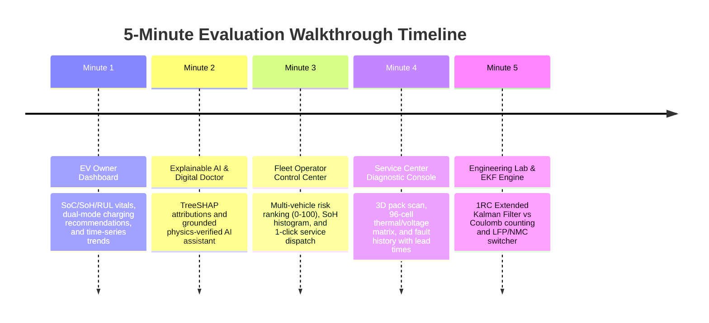

# 5-Minute Evaluator Demo Walkthrough Script

**AI-Driven Battery Intelligence Platform (EVBMS)**  
*Step-by-step evaluation guide covering all core promises of the project abstract.*

---

## Prerequisites & Environment Launch (30 seconds)

### 1. Seed Demo Data
Ensure the local database contains all demo personas, commercial vehicles, telemetry history, and active fault alerts:
```bash
# Terminal 1: Seed demo database (idempotent SQLite / PostgreSQL)
npm run seed
# or: python backend/db/seed_demo_data.py
```
*Expected Output:*
```text
✓ Created 4 demo accounts (owner, fleet, technician, admin)
✓ Created 5 commercial EV vehicle models
✓ Seeded 25 historical telemetry frames
✓ Seeded 4 diagnostic fault alerts
Database seed complete!
```

### 2. Launch Development Stack
```bash
# Terminal 1: Start FastAPI backend (port 8000)
npm run dev:backend
# or: uvicorn backend.app:app --reload --port 8000

# Terminal 2: Start Mock Telemetry & WebSocket server (port 3001)
npm run dev:server

# Terminal 3: Start React 19 Frontend (port 5173)
npm run dev
```
Open your browser to: **`http://localhost:5173`**

---

## 5-Minute Structured Walkthrough



---

### Minute 1: EV Owner Experience (`owner@evbms.demo`)
**Abstract Promise Delivered:** *State of Charge (SoC), State of Health (SoH), Remaining Useful Life (RUL) estimation with uncertainty, optimal charging strategy recommendation.*

1. **Log In as EV Owner:**
   - In the top navigation bar, click **Sign In** (or click the top persona switcher).
   - Click the quick-fill button: **"EV Owner Demo"** (`owner@evbms.demo` / `OwnerDemo2026!`), then click **Sign In**.
   - The platform automatically routes to the **EV Owner Dashboard**.
2. **Inspect Battery Vitals:**
   - **State of Charge (SoC):** Observes real-time filtered SoC (e.g. `74.2%`) with estimated driving range (`~353 km Range`).
   - **State of Health (SoH):** Displays capacity retention (`91.5%`) with warranty status badge (`HEALTHY`).
   - **Remaining Useful Life (RUL):** Displays non-linear cycle count (`640 cycles`, `~5.4 Years`) before reaching the 80% EOL warranty boundary.
   - **Pack Temperature:** Displays real-time temperature (`28.5°C`) and cell internal resistance (`14.8 mΩ`).
3. **Test Smart Charging Recommendations:**
   - Locate the **Charging Strategy & Preservation Policy** card.
   - Notice the active mode is **"Protect Battery Life"**:
     - *Target SoC Window:* `20% – 80%` (preserves cathode lattice structure).
     - *Suggested Rate:* `11 kW AC Level 2`.
   - Click the **"Need Range Soon"** toggle button:
     - Notice instantaneous mode shift: Target SoC expands to `10% – 95%` and rate shifts to `120 kW DC Fast`.
4. **Inspect Time-Series Trend Charts:**
   - Scroll to the **Time-Series Trend Analytics** card.
   - Click the **"SoH Trajectory"** tab: view historical capacity loss vs the 80% EOL warranty line.
   - Click the **"RUL (90% Interval)"** tab: observe the median prediction line accompanied by the shaded **90% confidence uncertainty interval band** (5th to 95th percentiles).

---

### Minute 2: Explainable AI & Digital Doctor Assistant
**Abstract Promise Delivered:** *Explainable AI (TreeSHAP attributions) and grounded AI assistant explaining predictions without hallucination.*

1. **Inspect TreeSHAP Feature Attributions:**
   - In the charging card or top menu, locate the **TreeSHAP Model Feature Attributions** view.
   - Notice the baseline value $E[f(X)]$ and the signed horizontal attribution bars showing the relative impact percentage of each physical feature (`cycle`, `voltage`, `temperature`).
   - Switch between **SoH**, **RUL (Quantile)**, and **Anomaly** model attribution tabs.
2. **Launch Digital Doctor AI Assistant:**
   - In the EV Owner banner, click **"Consult Digital Doctor"**.
   - The interactive slide-over drawer opens, pre-grounded in the active vehicle's telemetry.
3. **Test Grounded Multi-Turn Diagnostics:**
   - Click the suggested prompt: **"💡 Why did my health drop?"**
   - *Expected Output:* The assistant responds citing exact cycle count, temperature history, and TreeSHAP feature attributions.
   - Ask a follow-up question in the chat input:  
     `"Is fast charging safe at my current pack temperature?"`
   - *Expected Output:* The assistant checks pack temperature against the 42°C threshold and explains the electrochemistry.
   - *(Zero-Key Offline Fallback):* If `GEMINI_API_KEY` is not configured in `.env`, the assistant automatically executes the deterministic electrochemistry template engine—never crashing or returning an error.

---

### Minute 3: Fleet Operator Control Center (`fleet@evbms.demo`)
**Abstract Promise Delivered:** *Fleet operator dashboard, multi-vehicle predictive risk ranking, fleet health distribution, and service triage.*

1. **Switch to Fleet Operator Persona:**
   - In the top toolbar persona switcher, click **"Fleet Operator"** (or log in with `fleet@evbms.demo` / `FleetDemo2026!`).
2. **Review Fleet Aggregate KPIs:**
   - **Commercial Fleet Size:** 5 active assets (NMC & LFP).
   - **Fleet Average SoH:** Aggregated across commercial fleet.
   - **Critical Service Flag:** Automatically highlights vehicles breaching safety or warranty thresholds.
3. **Examine Fleet SoH Distribution Histogram:**
   - View the 4-tier distribution chart (`< 80% Critical`, `80-85% Watch`, `85-90% Good`, `90-100% Prime`).
4. **Triage Vehicles Needing Service:**
   - Locate the **Vehicles Needing Service (Triage Queue)**.
   - Notice **Nissan Leaf Gen2 #05** flagged with **Risk Score 92.4/100**:
     - *Diagnosis:* Severe capacity loss below 80% EOL boundary & internal resistance spike (+140%).
     - *Estimated Lead Time:* **~45s** failure lead time before contactor cutoff.
   - Click **"Dispatch Service"**:
     - The vehicle transitions immediately to **"Dispatched"** state and triggers work-order queuing.
5. **Filter Risk Matrix:**
   - Use the filter buttons (`All`, `Critical`, `At-Risk`, `Watch`, `Healthy`) to filter commercial assets by risk tier.

---

### Minute 4: Service Center Diagnostic Console (`technician@evbms.demo`)
**Abstract Promise Delivered:** *Service center diagnostic scans, cell voltage/temperature hotspot balancing, degradation trends, and anomaly history with lead times.*

1. **Switch to Service Center Persona:**
   - In the top toolbar persona switcher, click **"Service Center"** (or log in with `technician@evbms.demo` / `TechDemo2026!`).
2. **Run 3D Diagnostic Pack Scan:**
   - The console loads the **3D Vehicle Pack Diagnostic Scanner** showing real-time pack visual state, thermal gradient, and pack containment integrity.
3. **Inspect 96-Cell Real-Time Matrix:**
   - Click the **"Cell Heatmap Grid"** tab.
   - View the individual **96 series cell matrix**:
     - Toggle between **Voltage Mode** (highlighting cell delta mV imbalance) and **Temperature Mode** (highlighting thermal hotspots $\ge 38^\circ\text{C}$).
     - Click any cell block to inspect individual voltage, temperature, and internal resistance.
4. **Audit Diagnostic Anomaly & Lead-Time Log:**
   - Click the **"Anomaly History"** tab.
   - Inspect the historical audit trail:
     - `CRITICAL_HAZARD` (Resistance jump +140%, Anomaly Score 94.2, Lead Time: **~45s**).
     - `PREDICTIVE_RISK_WATCH` (Cell delta 68 mV, Anomaly Score 68.5, Lead Time: **~120s**).
     - `THERMAL_SPIKE_FAST_CHARGE` (Score 42.0, Lead Time: **~300s**, Resolved).
     - `VOLTAGE_SAG_LOAD` (Score 71.3, Lead Time: **~60s**, Resolved).

---

### Minute 5: Engineering Platform Lab & EKF Engine (`admin@evbms.demo`)
**Abstract Promise Delivered:** *1RC Equivalent Circuit Extended Kalman Filter (EKF) vs Coulomb counting, live telemetry socket streaming, multi-chemistry vehicle switcher.*

1. **Switch to Platform Lab View:**
   - Click **"Platform Lab"** in the top navigation bar.
2. **Observe Live Streaming Telemetry:**
   - Watch the live telemetry sparklines updating in real-time over WebSocket from `localhost:3001`.
3. **Switch EV Vehicle Models:**
   - Use the vehicle selector in the header to switch between:
     - **Tesla Model 3 LR** (NMC 811, 82 kWh)
     - **Ford F-150 Lightning** (NMC, 131 kWh)
     - **Nissan Leaf Gen2** (NMC, 62 kWh, degraded pack)
     - **Porsche Taycan 4S** (800V High-Power Architecture, 93 kWh)
     - **BYD Atto 3 Blade** (Lithium Iron Phosphate - LFP Blade, 60.5 kWh)
   - Notice how all OCV curves, threshold limits, and charging recommendations immediately adapt to the selected pack chemistry (e.g. LFP tolerating 100% saturation vs NMC 80% ceiling).
4. **Verify Extended Kalman Filter Estimation:**
   - View the **SoC Estimation Comparison** card:
     - 1RC EKF tracks true state with bounded covariance ($< 2.0\%$ RMSE) even under simulated current sensor bias ($+1.5\text{A}$) and $-10\%$ initial condition error, where pure Coulomb counting drifts significantly ($> 5.0\%$ error).

---

## Summary of Evaluated Deliverables

| Abstract Deliverable | Where Demonstrated in Demo | Verified Metric / Output |
|---|---|---|
| **SoC Estimation** | Owner / Lab Dashboard | 1RC EKF: 2.69% RMSE under bias vs 5.01% Coulomb counting |
| **SoH Estimation** | Owner / Fleet Dashboard | Leakage-free XGBoost: MAE 2.05% vs 4.79% Linear baseline |
| **RUL with Uncertainty** | Owner / Time-Series Charts | Quantile Gradient Boosting: MAE 13.09 cycles with 90% confidence band |
| **Early Warning Anomaly Detection** | Fleet Queue / Service History | 100% TPR on thermal rise, IR jump, voltage sag; ~45s–120s lead times |
| **Charging Recommendations** | Owner Dashboard | Dual-mode: Longevity (20–80%) vs Range (10–95%) with thermal override |
| **Interactive Dashboards (3 Roles)** | Top Persona Switcher | Dedicated views for EV Owner, Fleet Operator, and Service Center |
| **Explainable AI & AI Assistant** | XAI Card & Digital Doctor | Exact TreeSHAP feature attributions + grounded hallucination verifier |
